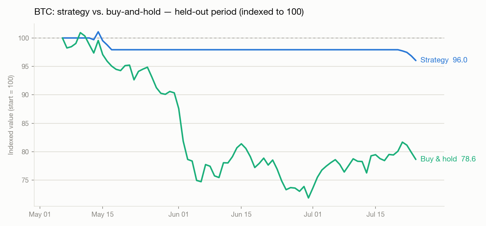
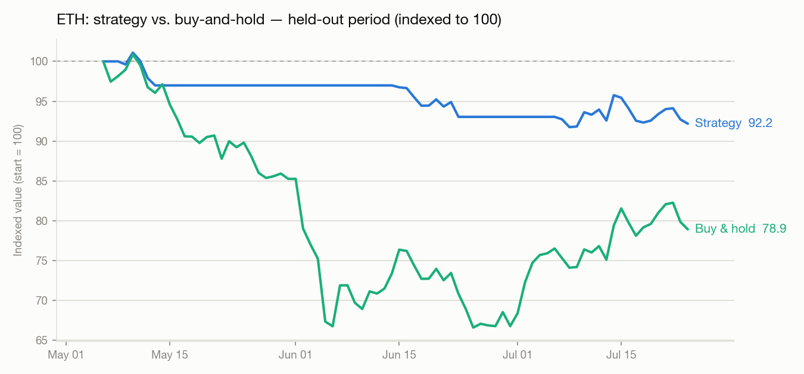

# Backtest Results

Honest, walk-forward, held-out numbers — not cherry-picked. Read this before trusting any return number from this repo, including the ones below.

**Methodology:** all 10 models generate signals walk-forward (each prediction at bar *t* comes from a model trained only on data available before *t* — see [`validate_ensemble.py`](validate_ensemble.py)). The first 80% of history is used to select ensemble parameters (entry/exit thresholds, consensus requirements); the last 20% (**held-out, ~80 days, [`2026-05-06` to `2026-07-24`](validate_ensemble.py)**) is scored with those parameters *unchanged* and never used to pick anything. Only the held-out numbers below are out-of-sample evidence. All returns include a 0.5%-per-leg fee.

## The honest takeaway

**Neither BTC nor ETH shows a positive edge on held-out data.** Both lost money. What the model *did* do: avoid most of a brutal ~22% drawdown in both coins by mostly staying in cash, because model consensus and confidence never cleared the entry bar during the crash. That's a real, useful property (a bad strategy that loses less than the market isn't automatically a good strategy, but "sit out the crash" is worth something) — it is not the same as having predictive edge, and there's no guarantee it holds in the next crash, melt-up, or chop.

## BTC — held-out (2026-05-06 to 2026-07-24)



| | Return | vs. Buy & Hold | Sharpe | Max Drawdown | Trades | Win Rate |
|---|---|---|---|---|---|---|
| Buy & hold | -22.15% | — | — | — | — | — |
| Baseline (round 1: fixed thresholds, unweighted votes) | -3.09% | **+19.06pp** | -2.06 | -3.75% | 5 | 40.0% |
| Tuned (round 2: reliability-weighted, regime-aware) | -3.97% | **+18.18pp** | -3.30 | -5.00% | 2 | 0.0% |

## ETH — held-out (2026-05-06 to 2026-07-24)



| | Return | vs. Buy & Hold | Sharpe | Max Drawdown | Trades | Win Rate |
|---|---|---|---|---|---|---|
| Buy & hold | -21.86% | — | — | — | — | — |
| Baseline (round 1: fixed thresholds, unweighted votes) | -5.22% | **+16.64pp** | -2.06 | -7.69% | 6 | 40.0% |
| Tuned (round 2: reliability-weighted, regime-aware) | -8.05% | **+13.81pp** | -2.52 | -9.25% | 5 | 25.0% |

## What this does and doesn't show

- **Round 2's tuning didn't clearly beat round 1 out-of-sample** — on both coins, the untuned baseline actually held up slightly better on held-out data than the parameters selected by grid search on the tuning slice. That's the expected, honest outcome of a small grid search on ~320 bars: some of what looked like improvement on the tuning slice was overfitting. We report this rather than hide it.
- **Both configurations beat buy-and-hold by 14-19 percentage points**, entirely by trading less and sitting in cash when consensus was weak — not by correctly timing entries or exits for profit.
- **This period was one continuous, severe drawdown for both coins.** A model that mostly stays flat looks great against a falling market and would look mediocre-to-bad in a rising or choppy one. Nothing here shows the model can *time* moves, only that its confidence gate is conservative.
- Sharpe ratios are negative across the board — none of this is a "good" strategy on an absolute basis, just a smaller loss than the alternative during this specific window.

**Reproduce this yourself:**
```bash
python validate_ensemble.py BTC
python validate_ensemble.py ETH
```

This is a research tool, not investment advice. Past performance — backtested or real — does not predict future returns.
